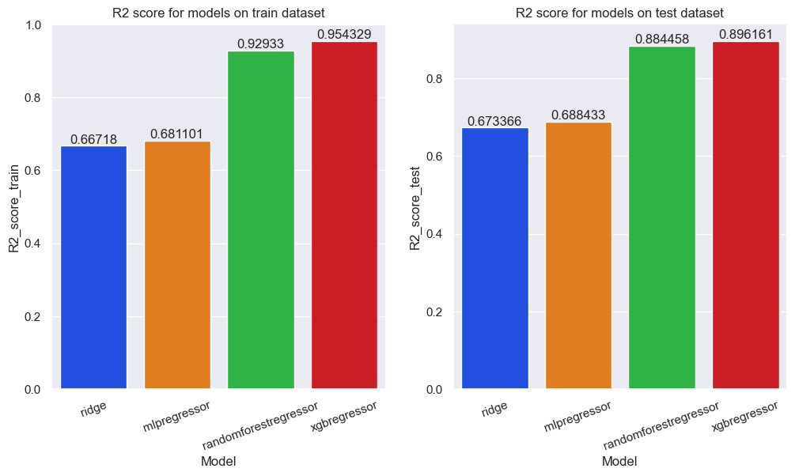

# Car-prices-prediction

The goal was to build a model that would predict car prices. I am working on a dataset from kaggle, the data comes from a Polish car sales site.

R2 score of models after data preprocessing and hyperparameter tuning:

Data source: <https://www.kaggle.com/datasets/aleksandrglotov/car-prices-poland>
